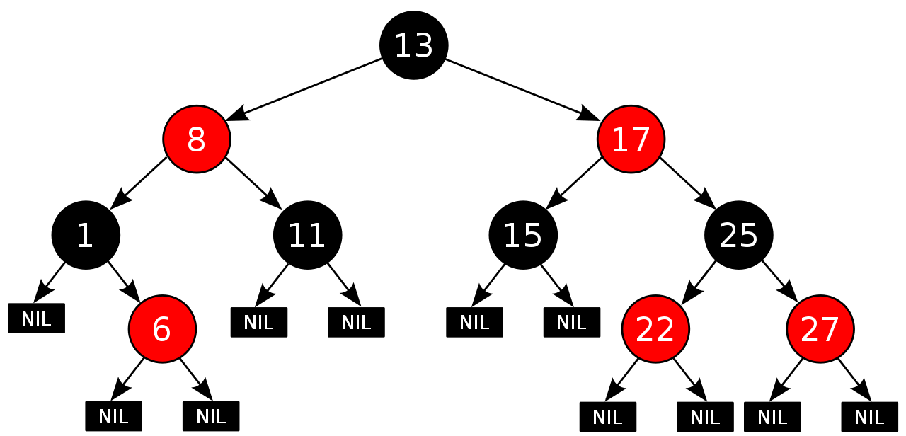
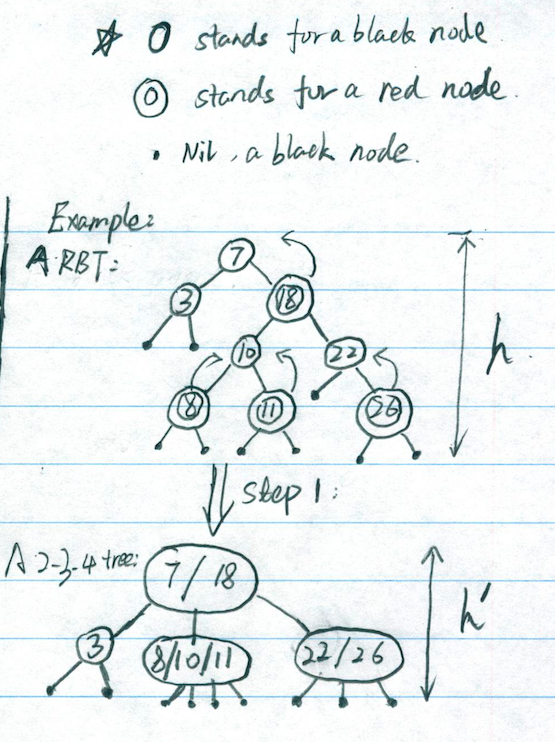

# Red-Black Trees

## Contents

[History](https://github.com/Rainicy/Algorithms/blob/master/notes/RedBlackTree.md#history)

[Binary Search Tree](https://github.com/Rainicy/Algorithms/blob/master/notes/RedBlackTree.md#binary-search-tree)

1. [What's Binary Search Tree](https://github.com/Rainicy/Algorithms/blob/master/notes/RedBlackTree.md#1-whats-binary-search-tree)
2. [The Running Time](https://github.com/Rainicy/Algorithms/blob/master/notes/RedBlackTree.md#2-the-running-time)
3. [Balanced Search Tree](https://github.com/Rainicy/Algorithms/blob/master/notes/RedBlackTree.md#3-balanced-search-tree)

[Red-Black Trees](https://github.com/Rainicy/Algorithms/blob/master/notes/RedBlackTree.md#red-black-trees-1)

1. [What's Red-Balck Tree?](https://github.com/Rainicy/Algorithms/blob/master/notes/RedBlackTree.md#1-whats-red-balck-tree)
2. [Height of Red-Black Tree](https://github.com/Rainicy/Algorithms/blob/master/notes/RedBlackTree.md#2-height-of-red-black-tree)
3. [Operations](https://github.com/Rainicy/Algorithms/blob/master/notes/RedBlackTree.md#3-operations)
4. [Rotations](https://github.com/Rainicy/Algorithms/blob/master/notes/RedBlackTree.md#4-rotations)
	* [Right-Rotate](https://github.com/Rainicy/Algorithms/blob/master/notes/RedBlackTree.md#right-rotate)
	* [Left-Rotate](https://github.com/Rainicy/Algorithms/blob/master/notes/RedBlackTree.md#left-rotate)

[References](https://github.com/Rainicy/Algorithms/blob/master/notes/RedBlackTree.md#references)

## History

This note will talk about the traditional Red-Black Trees algorithms. This original data structure was invented in 1972 by [Rudolf Bayer](http://en.wikipedia.org/wiki/Rudolf_Bayer) and named "symmetric binary B-Tree", but acquired its modern name in a paper in 1978 by [Leonidas J. Guibas](http://en.wikipedia.org/wiki/Leonidas_J._Guibas) and [Robert Sedgewick](http://en.wikipedia.org/wiki/Robert_Sedgewick_(computer_scientist)) entitled "A Dichromatic Framework for Balanced Trees". ([From WikiPedia](http://en.wikipedia.org/wiki/Red%E2%80%93black_tree))

## Binary Search Tree

Before talking about the Red-Black Trees(RBT), we need better know the Binary Search Tree(BST), because in fact the RBT is a BST. 

##### 1. What's Binary Search Tree?

A binary search tree is an empty tree or a tree meets the properties as following:

	- The left subtree of a node contains only nodes with keys less than the node's key.
	- The right subtree of a node contains only nodes with keys greater than the node's key.
	- The left and right subtree each must also be a binary search tree.
	- Each node can have up to two successor nodes.
	- There must be no duplicate nodes.

An example of a Binary Search Tree is shown as following: from [WikiPedia](http://en.wikipedia.org/wiki/Binary_search_tree)


##### 2. The Running Time 

We know that each basic operation on a binary search tree runs in O(h), which h is the height of the tree. So we want to minimize the h. But how? We know the minimum of h should be lg(N), where N is the number of nodes in the tree. One way to meet O(lgN) time is the Randomly building the Binary Search Tree, which is described in the _Chapter 12.4 Randomly built binary tree_ in __[INTRODUCTION TO ALGORITHMS]__.

So when we initialize a binary tree randomly, maybe we can meet O(lgN) for a while. But with the operations(like insertion or deleting) doing, we cannot guarantee the BST's height be O(lgN). And the worst case running time may become O(N), which we don't want to see. Then let's see another definition of tree, called balanced search tree as following.

##### 3. Balanced Search Tree

Balanced Search Tree is a search tree data structure, maintaining dynamic set of N elements using tree of height O(lgN).

Here given some balanced search tree examples:

	- Red-Black Trees
	- AVL Tree
	- 2-3 Tree
	- 2-3-4 Tree
	- B-Tree
	- Skip List
	- Treaps

## Red-Black Trees

Red-Black Trees is a balanced search tree, which can maintain dynamic set of N nodes using tree of height O(lgN). Before we prove this, let's see what's the definition of Red-Black Trees. 

##### 1. What's Red-Balck Tree? 

It's a Binary Search Tree data structure with extra color field for each node and the following must be satisfied by the RBT:

	1. A node is either red or black.
	2. The root is black.
	3. All leaves(NIL) are black.
	4. Every red node must have two black child nodes. (Every red node has black parent.)
	5. Every path from a given node to any of its descendant leaves contains the same number of black nodes.

By the above 5 properties, we can get a critical property of red-black trees: that **_the path from the root to the furthest leaf is no more than twice as long as the path from the root to the nearest leaf._** The result is that the tree is roughly height-balanced. 

An example of Red-Black Trees is showing as following: from [WikiPedia](http://en.wikipedia.org/wiki/Red%E2%80%93black_tree)



#### 2. Height of Red-Black Tree

By the definition of the RBT, does the height h meet the balanced search tree height of O(lgN) (h <= O(lgN))? 

The following steps are the proof of that Red-Black Trees with N keys has height h: 


* __Step 1__: Merge each red node to its black parent, after this, it will become a 2-3-4 trees. _(Shown in the following picture)_

* __Step 2__: Easy to get the number of leaves in the 2-3-4 trees is N+1.
* __Step 3__: If we set   be the height of a 2-3-4 trees, then easy to know the number of leaves(|leaves|)should be:

* __Step 4__: Then we get
 (Combined Step 2&3)
* __Step 5__: By the properties of RBT, we know that red node has black parent, so that there must be smaller than 1/2 nodes on any root-to-leaf path are red. When we did the Step 1, the disappeared red nodes must be smaller than 1/2 nodes. We can derivate that the height of RBT h must be 

* __Step 6__: Finally we get 
 (Combined Step 4&5)

Now we can see that the Red-Black Tree is a good balanced tree, which can always maintain O(lgN) height. Once we get the data structure, we want to do some operations on this data structure.

#### 3. Operations

There are two different kinds of operations, one will maintain the RBT properties and another one may lead the violation of the properties.

###### 1. Queries

The queries include search, max, min, successor, predecessor etc. All of these operations just look up the node in the RBT, which won't break the tree structure. And all these queries can run in O(lgN) time in the Red-Black Tree.

###### 2. Updates

The updates contain insert and delete, which will lead the violation of the RBT properties. So after updating the nodes in the RBT, we may modify the tree to meet the RBT properties again. 

About modifying the tree, we need know:

	1. The basic Binary Search Tree operations, like root(), parent(), left(), right() etc.
	2. Color changes, which is easy, change the node's color from one to another one. 
	3. Restructuring of links via Rotations

Here we won't give details about the BST operations and color changes. We just look at the algorithms on Rotations.

#### 4. Rotations

There are two ways to rotate the tree: Left-Rotate & Right-Rotate. _(Shown as following from [WikiPedia](http://en.wikipedia.org/wiki/Tree_rotation))_


_(When we describe nodes in the tree, all nodes are males.)_

##### Right-Rotate

Right-Rotate is operated on the node(Q in the picture), who should meets the requirement:

	1. He(Q) has left child(P).

The goal of Right-Rotate, make the node himself(Q) become his left child's(P) right child. Let's see what happened to the links:

	1. Q becomes P's right child. (Happend)
	2. B cannot be P's right child anymore, replaced by Q.(B is independent now)
	3. Q's left child(P) is gone. (We need someone coming to Q's left new child, which should be the independent one B.)

Algorithm for Right-Rotate:

```
Right-Rotate(T, x):						// x stands for Q
	1. y = x.left 						// find x(Q)'s left child y(Q)
	2. x.left = y.right 				// before B becomes independent, joint the B to x(Q)'s left child.
	3. if (y.right != null)				// if B is not null, set x(Q) as his parent.
	4. 		y.right.parent = x
	5. y.parent = x.parent 				// Set x(Q)'s parent to y(P)'s
	6. if (x.parent == null) 			// If x(Q) is the root
	7. 		T.root = y
	8. else if (x == x.parent.left)		// if Q is the left child
	9. 		x.parent.left = y
	10. else 							// if Q is the right child
	11. 	x.parent.right = y
	12. y.right = x						// join x(Q) and y(P)
	13. x.parent = y

```


##### Left-Rotate

The similar with Right-Rotate, the Left-Rotate should be operated on the node(P), who meets:
	1. He has right child(Q).
	
The goal of Left-Rotate is making the node himself(P) become his right child's(Q) left child. What happened?

	1. P becomes Q's left child. (Happened)
	2. B cannot be Q's left child anymore, replaced by P. (B is independent again now)
	3. P's right child(Q) is gone. (We need the independent B becomes P's right new child.)

Algorithm for Left-Rotate:

```
Left-Rotate(T, x):						// x stands for P in the picture.
	1. y = x.right 						// find P's right child(Q) to y(Q)
	2. x.right = y.left 				// before B becomes independent, let B be P's right child. 
	3. if (y.left != null)				// Set B's parent to x(P), not y(Q) anymore
	4. 		y.left.parent = x
	5. y.parent = x.parent 				// Set x(P)'s parent to y(Q)
	6. if (x.parent == null)			// if x(P) is the root, update the root
	7. 		T.root = y
	8. else if (x == x.parent.left) 	// if P is the left child
	9. 		x.parent.left = y
	10. else 							// if P is the right child
	11. 	x.parent.right = y
	12. y.left = x						// set x(P) as y(Q)'s left son
	13. x.parent = y					// set x(P)'s parent as y
```

## References

[Introduction to Algorithms](http://mitpress.mit.edu/books/introduction-algorithms)

[红黑树(一)之 原理和算法详细介绍](http://www.cnblogs.com/skywang12345/p/3245399.html)

[教你透彻了解红黑树](https://github.com/julycoding/The-Art-Of-Programming-By-July/blob/master/ebook/zh/03.01.md)
